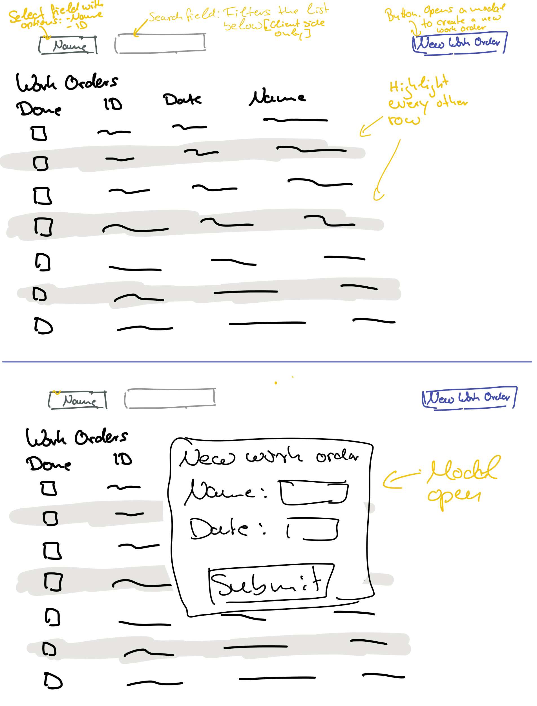

# Frontend exercise

## Introduction

In this exercise we would like you to create a small application to create and store work orders.

Things we're interested in seeing:

- You write a solution that is easily understandable while being easy to evolve and change.
- You share with us your thoughts about the problem.
- You guide us through your thought process.

We are here to help you during the interview so don't be afraid to ask questions at any point. And of course you can use the internet to search for anything you need.

## Overview

We prepared a monorepo containing a React based frontend application (in `/apps/web`) and a small backend (in `/app/api`) using Express.

To install the application run

```
npm run setup
```

and to start the development run

```
npm run dev
```

## The application

In this exercise we want you to create a small application to create and store work orders.
A work order has the following interface

```ts
interface IWorkOrder {
  id: string
  date: string
  done: boolean
  name: string
}
```

Here is a rough sketch of the application we want to create



### Tasks

Our application should have the following features:

1. At the core we want to display a list of all work orders.
   The list of all work orders consists of 4 columns: Done, ID, Date, and Name.
   In the Done column we want to have checkboxes such that if I click on the checkbox
   the update is automatically sent to the server.
   In our list of work orders every other row should be highlighted / have a background color.

2. We want to be able to create new work orders. For this, on the top right there is a button `New Work Order`
   that opens up a modal / overlay that contains a small form to create a new work orkder (see the bottom half of the drawing).
   The modal should be centered and automatically close after a work order got created.
   After a work order got created, the list of work order should automatically update.

3. We want to be able to search our list of work orders by either the name or the ID of a work order.
   For this we have on the top left a select field with two options: Name and ID.
   Next to the select is an input field. The list of work order should be filtered depending on the input value
   and the value of the select field. If the input is empty all work order have to be shown.
   The search is only on the client side. However, we want to update our list at most once every 300ms.

You should also take 10-15 minutes to give the application a decent look.

To accomplish your tasks the backend provides the following REST endpoints:

- `GET /api/work-orders`

  This returns a list of all work orders (type: `IWorkOrder[]`).

- `POST /api/work-orders`

  This endpoint creates a new work order with a given name and date. This expects as a body `{name: string, date: string}`.
  It returns a list of all existing work orders (type: `IWorkOrder[]`).

- `PUT /api/work-orders/:id/check`

  This endpoint expects as a body `{done: boolean}` and sets the `done` field of the work order with the given id `id` to the given value of `done`. It returns a list of all exisiting work orders (type: `IWorkOrder[]`).
